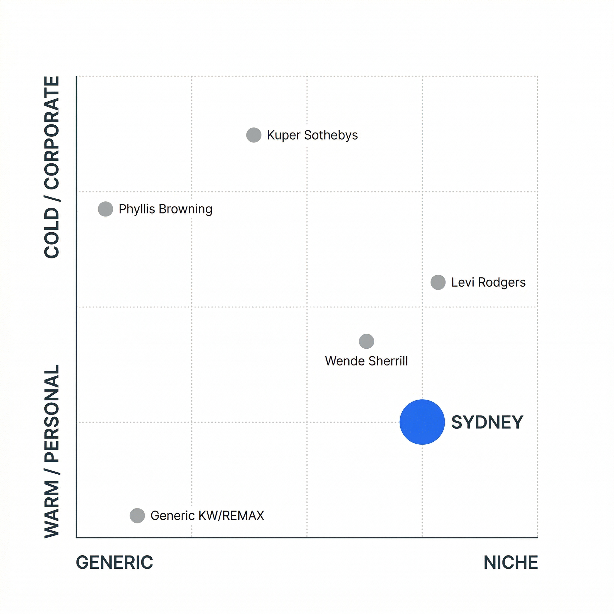
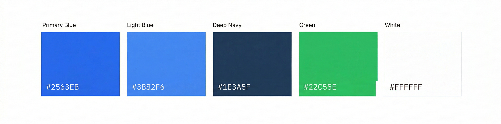

# Brand Positioning Statement — Sydney Spillman & Associates
**Milestone:** 01 — Discovery Session
**Date:** 2026-03-31
**Prepared by:** Ink (PM-dispatched)

---

## Market Positioning Overview

### Where Sydney Sits in the SA Real Estate Market

San Antonio — the 7th most populous US city (population 1.53M, metro 2.52M as of 2025; [U.S. Census QuickFacts](https://www.census.gov/quickfacts/sanantoniocitytexas)) — has a real estate landscape broadly segmented into three lanes:

1. **Corporate luxury** — Phyllis Browning, Kuper Sotheby's, Stanberry & Associates. Prestige positioning, high price points, cold/aspirational energy. Serves The Dominion, Olmos Park, Terrell Hills.
2. **Generic mid-market** — The largest and most undifferentiated category. Hundreds of KW, RE/MAX, and Coldwell Banker agents using the same template website, same "call me your San Antonio expert" positioning, same listing-dump social media strategy.
3. **Niche authority** — A small group of agents who have staked out a specific identity: Levi Rodgers (military/VA loans), bilingual community-embedded agents (Hispanic first-time buyers, west/south SA), and a handful of hyperlocal neighborhood specialists.

**Sydney Spillman occupies a gap in category 3 that is nearly wide open:**
A warm, story-driven, personality-forward agent who serves first-time buyers, military families, and growing families in North/Northwest San Antonio — with a genuinely differentiated brand, a custom web presence, and content marketing no comparable SA agent is currently doing well.

---

## Competitive Positioning Map


*Sydney occupies the warm-niche quadrant — a gap no comparable SA agent currently fills.*

```
                   COLD / CORPORATE
                         │
    Phyllis Browning ----+---- Kuper Sotheby's
    (luxury heritage)    │     (prestige by association)
                         │
NICHE ─────────────────── ─────────────────── GENERIC
    Levi Rodgers         │              KW / RE/MAX agents
    (military niche)     │              (undifferentiated)
                         │
                    [SYDNEY]
             Warm authority /
          community-first /
          approachable expert
                         │
                  WARM / PERSONAL
```

Sydney's position: **warm niche authority**. She is not competing with luxury agents. She is not drowning in the generic mid-market pool. She is carving out the "trusted neighborhood guide" lane for SA's largest underserved buyer segments.

---

## Primary Differentiation Pillars

### 1. Personality-Forward Personal Brand
Most SA agents present a professional mask — headshot, credentials, listings. Sydney presents a real person: someone who knows the neighborhoods because she lives and breathes SA, who communicates like a human, who clients feel they know before they ever call.

**No comparable SA agent at the mid-market level is doing this well.**

### 2. First-Time Buyer & Military Relocation Specialization
Two of SA's largest buyer segments — military families ([JBSA](https://jbsaondemand.com/) is one of the largest military installations in the US) and first-time buyers — are underserved by agents who combine both warmth AND professional expertise. Nationally, the first-time buyer share has fallen to a record low of 21%, with median age rising to 40 ([NAR 2025 Profile of Home Buyers and Sellers](https://www.nar.realtor/newsroom/first-time-home-buyer-share-falls-to-historic-low-of-21-median-age-rises-to-40)) — a population that desperately needs approachable, education-forward agents.

Levi Rodgers has locked down the veteran/VA loan specialist identity. Sydney doesn't compete in that lane — she complements it by owning the **relocation + community guidance** dimension that Levi's brand (more tactical/transactional) leaves open.

### 3. Hyperlocal North/Northwest SA Depth
Stone Oak, Alamo Ranch, Shavano Park, Helotes, Cibolo — some of SA's fastest-growing residential corridors ([Top SA Suburbs 2025 — PODS](https://www.pods.com/blog/san-antonio-suburbs)). Sydney can establish authority here through neighborhood content, school district guidance, and community-level knowledge that generic agents cannot credibly offer. San Antonio gained 23,945 new residents in 2023–2024 alone ([Census Bureau via Axios SA](https://www.axios.com/local/san-antonio/2025/03/13/san-antonio-texas-population-growth-census-data)) — many arriving from Austin, California, and other high-cost metros seeking affordability.

### 4. Content-Forward Digital Presence
Blog posts, neighborhood guides, Instagram Reels, YouTube walk-throughs — almost no individual SA agent in the mid-market tier has invested in this. Sydney can rank in organic search and build an audience before she has a single listing live.

---

## Tone Definition

### The Core Feeling: Professional Warmth
Sydney's brand should feel like talking to a friend who happens to be a real estate expert — not an agent who is pretending to be your friend. The warmth is real because it's grounded in genuine neighborhood knowledge and authentic care for clients' outcomes.

**The tension she navigates well:**
- Professional enough that clients trust her in a high-stakes financial transaction
- Warm enough that first-time buyers don't feel talked down to or rushed
- Specific enough that her local knowledge feels earned, not generic
- Approachable enough that military families landing in an unfamiliar city feel guided, not sold to

### Tone Attributes

| Attribute | Description | Example |
|-----------|-------------|---------|
| **Warm** | Genuine interest in clients as people, not just buyers/sellers | "I ask about your commute and your kids' school because it matters where you end up" |
| **Knowledgeable** | Confident expertise without condescension | Clear explanations of the buying process, no jargon |
| **Specific** | References real neighborhoods, real streets, real community context | "Alamo Ranch feels different from Stone Oak — here's why that matters for your family" |
| **Encouraging** | Especially with first-time buyers — process-guide energy | Makes the complex feel manageable |
| **Honest** | Direct feedback on pricing, offers, market conditions | Doesn't sugarcoat when a house is overpriced or an offer is weak |

### Voice in Practice

**Headlines / CTAs:** Active, direct, human
- "Let's find the right neighborhood first." ✓
- "San Antonio Real Estate Agent Serving All Your Needs" ✗

**Social content:** Personal, specific, neighborhood-first
- "Stone Oak vs. Alamo Ranch — what families actually say after a year" ✓
- [Listing photo with price and bedroom count, no caption] ✗

**Bio copy:** First-person, story-driven
- "I grew up believing home isn't just a house — it's the neighborhood, the people, the taco place you go every Saturday." ✓
- "Sydney Spillman is a licensed real estate professional serving the greater San Antonio metropolitan area." ✗

---

## Anti-References

These are the brand directions Sydney explicitly does not take.

### What to Avoid

| Anti-Reference | Why It's Wrong for Sydney |
|----------------|--------------------------|
| **Corporate navy + gold palette** | Overdone by Sotheby's, Phyllis Browning, and half the SA market. Signals "luxury" but also signals "cold and impersonal." Sydney's palette is white + warm blue — approachable, fresh, never stiff |
| **"Full-service real estate agent"** taglines | Generic to the point of meaning nothing. Every agent claims this. It says nothing about Sydney specifically |
| **Stock photography** | Happy couple with keys, bird's-eye suburb shot, same Canva templates. Makes the brand look like every other agent. Sydney's photography should feature her, real neighborhoods, real community moments |
| **Listing-only social media** | Posting nothing but listings signals "I'm here when I have something to sell." Sydney's content should educate, guide, and build community before and between transactions |
| **Pretending to be luxury** | Sydney serves buyers and sellers across SA's accessible-to-mid-market range. Reaching for aspirational luxury positioning would alienate her core audience and feel inauthentic |
| **Brokerage-reliant identity** | "Agent at [Big Brand Brokerage]" is not a personal brand. Sydney's identity should be built around Sydney Spillman, not borrowed from a franchise name |
| **Jargon-heavy copy** | "Leveraging synergistic market insights to optimize your real estate portfolio" — this is not how Sydney talks. Not how her clients think. Write like a smart, warm person who knows a lot |

---

## Positioning Statement (Final Draft)

> **Sydney Spillman is San Antonio's community-first real estate guide — the agent who knows the neighborhoods as a neighbor, not just a data set. Specializing in first-time buyers, military relocations, and families growing into their next home, Sydney brings professional expertise with genuine warmth: honest market guidance, deep local knowledge, and the kind of care that makes a high-stakes decision feel like you have a trusted friend in your corner.**

---

## Strategic Content Direction (Seeds for Phase 2)

Based on this positioning, Sydney's brand platform should be built around:

1. **"Moving to San Antonio" content hub** — blog + video series answering every question a relocating family has
2. **Neighborhood comparison guides** — "Stone Oak vs. Alamo Ranch," "Best school districts in North SA," etc.
3. **First-time buyer education series** — "What to expect when buying your first SA home" — Instagram Reels + blog
4. **Community storytelling** — behind-the-scenes neighborhood content, local restaurant/activity recommendations
5. **Testimonial-forward trust signals** — aggressive Google review cultivation from day one; stories from real clients

---

---

## Further Reading

- **[Personal Branding for Real Estate Agents: 2025 Guide — Matterport](https://matterport.com/learn/real-estate-branding/personal-brand)** — Comprehensive guide on building a personal brand as a real estate agent, with practical implementation strategies
- **[Real Estate Branding: The Complete Guide for Agents — The Close](https://theclose.com/real-estate-branding/)** — Covers brand positioning, voice development, and visual identity for real estate professionals
- **[NAR 2025 Profile of Home Buyers and Sellers](https://www.nar.realtor/research-and-statistics/research-reports/highlights-from-the-profile-of-home-buyers-and-sellers)** — Key market data: first-time buyer share at record low (21%), median first-time buyer age at 40, 88% of buyers used an agent
- **[San Antonio Population Growth — Census via Axios](https://www.axios.com/local/san-antonio/2025/05/16/san-antonio-texas-population-growth-census)** — SA metro grew by 205,000 people (2020–2024); 59% from out of state
- **[Best Neighborhoods in San Antonio 2026 — Sharp Realty Group](https://www.sharprealtygrouptx.com/blog/Best-Neighborhoods-in-San-Antonio--Where-to-Buy-in-2026)** — North/Northwest SA neighborhood growth data including Stone Oak, Helotes, Cibolo, and Alamo Ranch
- **[San Antonio Demographics — Texas Demographics](https://www.texas-demographics.com/san-antonio-demographics)** — Current SA demographic data: median age 34.9, 64% Hispanic, median household income $65,056

---

---


*Brand color palette: five core colors anchoring Sydney's visual identity.*

---

*Prepared for internal use — Milestone 01 Discovery Session deliverable.*
*Next: Competitor Audit (01-competitor-audit.md)*
