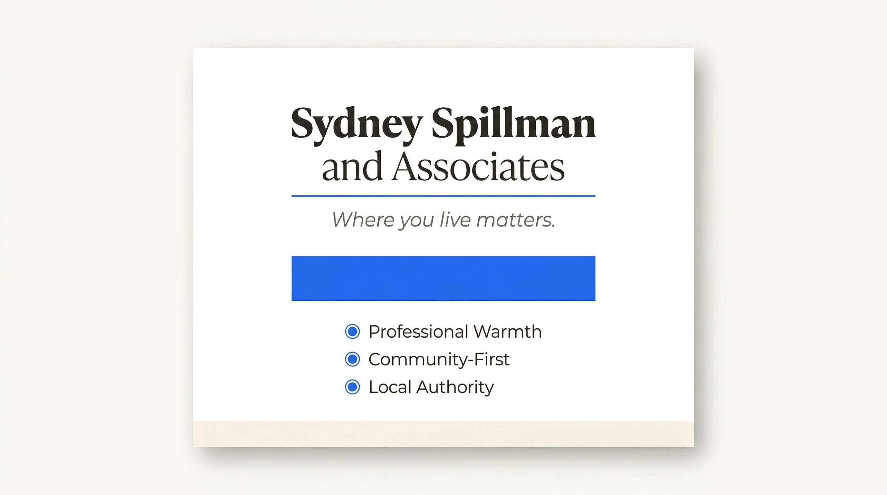

# Client Intake — Sydney Spillman & Associates
**Milestone:** 01 — Discovery Session
**Date:** 2026-03-31
**Prepared by:** Ink (PM-dispatched)

---

*Brand identity at a glance: Sydney Spillman & Associates — Professional Warmth, Community-First, Local Authority.*

---

## Brand Story

Sydney Spillman is a San Antonio, TX real estate agent building her practice around something the market is missing: a genuinely warm, community-first approach that treats every client like a neighbor, not a transaction.

Sydney's story isn't one of cold corporate credentials — it's one of roots. San Antonio is home. The neighborhoods she sells in are places she knows not as market data points, but as communities — the school down the street, the taco spot that's been there since forever, the block where families grow up and don't leave. That lived-in knowledge is her edge.

As she builds her brand under Sydney Spillman & Associates, the goal is to position her as the agent who makes real estate feel personal, approachable, and genuinely helpful — especially for buyers and sellers who may be overwhelmed by the process or new to the market.

---

## Core Brand Values

| Value | What It Means in Practice |
|-------|--------------------------|
| **Professional Warmth** | Sydney brings expertise without the ice — she communicates clearly, shows up prepared, and makes clients feel genuinely cared for |
| **Community-First** | She isn't just selling houses — she's matching people to neighborhoods. She talks schools, restaurants, vibes, neighbors |
| **Approachability** | First-time buyers don't feel intimidated. Military families new to SA don't feel lost. Every client feels like they have a guide, not a gatekeeper |
| **Integrity** | Honest market guidance even when it's not what clients want to hear. Long-term relationship over short-term transaction |
| **Local Authority** | Deep working knowledge of North/Northwest San Antonio — [Stone Oak](https://www.trulia.com/n/tx/san-antonio/stone-oak/90492/), [Alamo Ranch](https://www.neighborhoods.com/alamo-ranch-san-antonio-tx), [Shavano Park](https://www.pods.com/blog/san-antonio-suburbs), [Helotes](https://www.pods.com/blog/san-antonio-suburbs), [Cibolo](https://www.pods.com/blog/san-antonio-suburbs) — not just generic "SA agent" coverage |

---

## Target Audience Profiles

### Primary: First-Time Home Buyers
- Ages 26–38, households earning $55K–$100K/year
- Often overwhelmed by the process — need education and reassurance, not just listings
- Searching in San Antonio's accessible suburbs: [Alamo Ranch](https://www.neighborhoods.com/alamo-ranch-san-antonio-tx) ($180K–$500K), [Helotes](https://www.pods.com/blog/san-antonio-suburbs), far north SA, Converse, Schertz
- Motivated by: qualifying for a home, starting a family, getting out of renting. SA median home price (~$294K–$315K) is roughly half of Austin's, making it one of the most accessible major metros in Texas ([Zillow SA Market](https://www.zillow.com/home-values/6915/san-antonio-tx/))
- Sydney's edge: patience, education-forward communication, zero condescension

### Secondary: Military Families (Relocation)
- Active-duty and veterans affiliated with [JBSA (Joint Base San Antonio: Lackland, Randolph, Fort Sam Houston)](https://jbsaondemand.com/)
- Often have tight PCS timelines — need an agent who moves fast and knows the area cold
- VA loan expertise is expected; warmth and responsiveness are the differentiators
- Searching in: Schertz, Converse, Universal City, Stone Oak, Helotes
- Sydney's edge: approachable communication, clear timelines, community guidance (where to live, not just what to buy)

### Tertiary: Move-Up Buyers / Growing Families
- Ages 32–48, upgrading from starter home to larger family home
- Motivated by: more space, better school district, established neighborhood feel
- Target areas: [Stone Oak](https://www.trulia.com/n/tx/san-antonio/stone-oak/90492/) ($315K–$2.25M), [Alamo Ranch](https://www.neighborhoods.com/alamo-ranch-san-antonio-tx) ($180K–$500K), Shavano Park, The Dominion corridor
- Sydney's edge: neighborhood-level knowledge, helping families understand school district boundaries, community amenities

### Emerging Audience: San Antonio Transplants
- Relocating from Austin, Houston, California, or out-of-state
- Often remote workers or retirees drawn by SA's lower cost of living
- Need a local guide who can help them understand neighborhoods, culture, and lifestyle differences
- Sydney's edge: genuine community enthusiasm, content-forward digital presence

---

## Service Offerings

- **Buyer Representation** — Full-service buyer's agent for resale and new construction, with particular strength in first-time buyer education and military/VA transactions
- **Seller Representation** — Listing services including pricing strategy, staging guidance, marketing, and negotiation
- **Relocation Services** — Specialized support for PCS moves and out-of-state relocations; virtual tours, neighborhood briefings, fast timelines
- **New Construction Guidance** — Advising buyers on builder contracts, upgrades, and timelines in SA's active new build market
- **Community Consultation** — Neighborhood matching based on lifestyle, commute, schools, and community culture — not just price range

---

## Unique Value Proposition

**Draft UVP (long form):**
> "Sydney Spillman is the San Antonio real estate agent who makes the process feel less like a transaction and more like getting help from someone who actually knows the neighborhood — because she does. Whether you're buying your first home, relocating with the military, or upgrading for your growing family, Sydney brings the expertise of a seasoned professional and the warmth of someone who genuinely cares where you end up."

**Draft UVP (headline / short form):**
> "San Antonio real estate — with the warmth of a neighbor who knows every street."

**Draft UVP (tagline candidates):**
- "Find your home. Find your people."
- "Real estate done with heart."
- "Your neighborhood guide in San Antonio real estate."
- "Where you live matters. Let's get it right."

---

## Anti-Positioning (What Sydney Is NOT)

- She is **not** a cold corporate agent who treats buyers as commission checks
- She is **not** a luxury-only brand positioning on prestige and exclusion
- She is **not** a generic "full-service agent" with no distinct identity
- She is **not** relying on a big brokerage name to do the heavy lifting for her personal brand
- She does **not** use stock photography, template sites, or cookie-cutter listing posts to represent who she is

---

## Tone & Voice Reference

| Element | Description |
|---------|-------------|
| **Tone** | Professional warmth — knowledgeable but never intimidating, confident but never cold |
| **Voice** | First-person, conversational, specific — talks about real neighborhoods, real experiences |
| **Vocabulary** | Accessible — avoids jargon, translates real estate complexity into plain language |
| **Energy** | Enthusiastic about San Antonio, genuinely invested in clients' outcomes |
| **Visual feel** | White/clean with warm blue accents — approachable, fresh, not corporate navy |

---

---

## San Antonio Resources

### Market Data & Reports
- **SABOR (San Antonio Board of Realtors):** [sabor.com](https://sabor.com/) — [Market Statistics](https://sabor.com/market-research-and-statistics/market-statistics/)
- **Zillow SA Market Overview:** [zillow.com/home-values/6915/san-antonio-tx](https://www.zillow.com/home-values/6915/san-antonio-tx/)
- **Redfin SA Market Data:** [redfin.com/city/16657/TX/San-Antonio/housing-market](https://www.redfin.com/city/16657/TX/San-Antonio/housing-market)

### Homebuyer Assistance Programs
- **City of San Antonio — Housing Support:** [sa.gov/.../Housing-Support](https://www.sa.gov/Directory/Departments/NHSD/Housing-Support) — includes the Homeownership Incentive Program (HIP), offering up to $15,000 in mortgage assistance for income-eligible first-time buyers
- **City of San Antonio — HIP Program:** [sa.gov/.../HIP](https://www.sa.gov/Directory/Departments/NHSD/Housing-Support/Homeowner-Support/HIP)
- **TSAHC Down Payment Assistance (San Antonio area):** [tsahc.org/homebuyers-renters/san-antonio-area-down-payment-assistance](https://www.tsahc.org/homebuyers-renters/san-antonio-area-down-payment-assistance)
- **SA Housing Resource Guide (PDF):** [sanantonio.gov — NALCAB Resource Guide](https://www.sanantonio.gov/Portals/0/Files/NHSD/Programs/SAHousingResourceGuide_FINAL.PDF)

### Military Relocation (JBSA)
- **JBSA On Demand — Military Relocation Guide:** [jbsaondemand.com](https://jbsaondemand.com/)
- **JBSA Directory & Services:** [directory.jbsaondemand.com](https://directory.jbsaondemand.com/)
- **PCS to JBSA Guide (FamilyMedia):** [The Ultimate PCS Guide to Joint Base San Antonio](https://familymedia.com/article/base-guides-joint-base-san-antonio)
- **JBSA-Randolph PCS Guide 2026:** [pcspayitforward.com — JBSA Randolph](https://pcspayitforward.com/base/air-force-base/jbsa-randolph/)

### Neighborhood Guides
- **Stone Oak:** [Trulia Neighborhood Guide](https://www.trulia.com/n/tx/san-antonio/stone-oak/90492/) | [LRG Realty Guide](https://lrgrealty.com/lrg-blog/stone-oak-neighborhood-guide-in-san-antonio) | [Homes.com Schools](https://www.homes.com/school-search/san-antonio-tx/near/stone-oak-neighborhood/) (served by North East ISD — Hardy Oak Elementary, Lopez Middle, Reagan High)
- **Alamo Ranch:** [Neighborhoods.com Guide](https://www.neighborhoods.com/alamo-ranch-san-antonio-tx) | [LRG Realty Guide](https://lrgrealty.com/lrg-blog/alamo-ranch-san-antonio) | [Military Town Advisor Review](https://www.militarytownadvisor.com/off-base-housing/neighborhood-subdivision-review/TX/1573/alamo-ranch-san-antonio/) (served by Northside ISD — 3,000+ acre master-planned community, 20,000+ residents)
- **Helotes:** [San Antonio City Info — Suburbs Guide](https://www.sanantoniocityinfo.com/suburbs/) (tight-knit Hill Country community, strong schools, small-town feel)
- **Cibolo:** [Best Neighborhoods in SA 2026 — Sharp Realty](https://www.sharprealtygrouptx.com/blog/best-san-antonio-neighborhood-in-2026) (explosive growth, affordable entry ~$200K, close to Randolph AFB)

---

*Prepared for internal use — Milestone 01 Discovery Session deliverable.*
*Next: Brand Positioning Statement (01-brand-positioning.md)*
