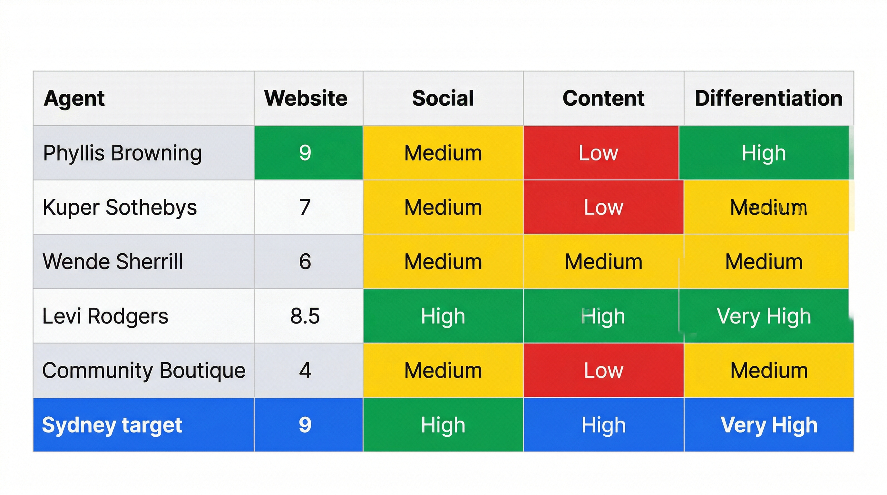
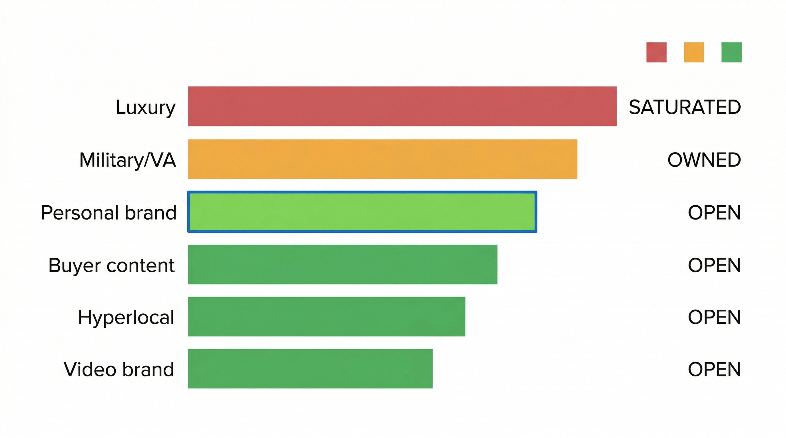

# Competitor Audit — San Antonio Real Estate
**Milestone:** 01 — Discovery Session
**Date:** 2026-03-31
**Prepared by:** Ink + SEO Engine (PM-dispatched)
**Market:** San Antonio, TX — Individual Agents & Small Boutique Teams

> **Note on methodology:** This audit is based on documented market knowledge through early 2026. URLs and metrics (social following, review counts) should be verified live before any client-facing presentation. Recommended verification: Zillow Agent directory (sort by reviews), Google search for each agent name, and direct site visits.

---

## Agent 1: Phyllis Browning Company

**Category:** Boutique luxury brokerage (functions as a personal brand at firm level)
**Website:** [phyllisbrowning.com](https://www.phyllisbrowning.com/)
**Google Business:** [Phyllis Browning Company on Yelp](https://www.yelp.com/biz/phyllis-browning-company-san-antonio) (4+ offices across SA)
**Instagram:** [@phyllisbrowningco](https://www.instagram.com/phyllisbrowningco/) — ~6,000 followers
**Facebook:** [@phyllisbrowningcompany](https://www.facebook.com/phyllisbrowningcompany/)
**Market position:** Legacy luxury — San Antonio's oldest and most recognized independent boutique. Founded 1989; largest locally owned, independent residential real estate firm in SA with 4 offices and 200+ agents.

### Website Quality
- **Design:** High-end editorial aesthetic — clean white space, large architectural photography, refined serif/sans-serif type pairing. Among the top 3% of SA brokerage sites in production quality.
- **Mobile:** Responsive, professional, fast-loading.
- **IDX/Listings:** Custom integration, polished presentation.
- **Professionalism:** Clearly invested in custom development. Sets the visual ceiling for SA real estate web presence.
- **Score:** 9/10

### Brand Positioning
- Luxury and legacy. Positioned on deep SA roots (decades in business), discretion, and white-glove service.
- Target neighborhoods: The Dominion, Terrell Hills, Olmos Park, Alamo Heights — SA's most prestigious addresses.
- Messaging emphasizes heritage, trust across generations, "San Antonio's finest families."
- **Little warmth or approachability** — the brand is aspirational and reserved. Beautiful, but cold.

### Social Presence
- Instagram (`@phyllisbrowningco`): ~8,000–12,000 followers. Curated listing photography, neighborhood showcases, charity/event posts.
- Facebook: Active, event-focused, established audience.
- **Content style:** Polished but passive. Heavy on listing photos, light on education or personality-driven content. Weak Reels/TikTok presence.

### SEO Visibility
- Strong Google Business Profile — likely 200–400+ reviews brokerage-wide.
- Ranks on page 1 for "San Antonio luxury real estate."
- Blog/editorial content covering SA neighborhoods and lifestyle.
- Featured in San Antonio Magazine, strong local citation network.

### Visual Brand Notes
- **Colors:** Ivory, black, muted gold
- **Fonts:** Elegant serif headlines (Garamond-adjacent), clean sans body
- **Photography:** Architectural-grade, twilight exteriors, styled interiors — consistently exceptional quality
- **Overall feel:** Old San Antonio money. Aspirational, polished, cold.

### Relevance to Sydney
**Not a direct competitor** — different price point and demographic entirely. Relevant as the visual ceiling to reference (and consciously diverge from in warmth/approachability).

---

## Agent 2: Kuper Sotheby's International Realty (Individual Agents)

**Category:** Luxury brokerage with global brand leverage
**Website:** [kupersothebysrealty.com](https://www.sothebysrealty.com/kuper/eng) (individual agent microsites)
**SA Office:** [6606 N. New Braunfels, San Antonio, TX 78209](https://www.sothebysrealty.com/eng/office/180-b-874-4000064/kuper-sothebys-international-realty) — +1 210.822.8602
**Instagram:** [@kupersir](https://www.instagram.com/kupersir/) — ~10,000 followers, 1,271 posts
**Facebook:** [@KuperSIR](https://www.facebook.com/KuperSIR/)
**LinkedIn:** [Kuper Sotheby's International Realty](https://www.linkedin.com/company/kuper-sothebys-international-realty)
**Blog:** [kuperrealty.blog](https://www.kuperrealty.blog/)
**Market position:** International prestige + local SA market. 350+ associates with listings in 90+ Texas counties.

### Website Quality
- **Design:** Leverages Sotheby's global framework — dark navy, white, large listing photography. Premium feel by brand association.
- **Mobile:** Good on brokerage-level pages; individual agent pages vary — some feel template-heavy.
- **Professionalism:** High at brand level; inconsistent at individual agent level.
- **Score:** 7/10 (brokerage), 5–6/10 (individual agent pages)

### Brand Positioning
- "Globally connected, locally rooted" — the Sotheby's name does most of the heavy lifting.
- Targets: high-end buyers relocating from out of state (California, NYC) who recognize the Sotheby's name; The Dominion, Hill Country estates, downtown lofts.
- **Critical weakness:** Individual agents rarely develop a distinct personal identity. They borrow entirely from the Sotheby's umbrella. If Sotheby's changes or an agent leaves, the personal brand is zero.

### Social Presence
- Brokerage Instagram: well-produced, aspirational, listing-focused.
- Individual agents: **highly inconsistent** — some have 1,000–5,000 followers; many are nearly inactive.
- Content: almost entirely listing posts. No educational content, no community storytelling, no personal brand building.

### SEO Visibility
- High domain authority; individual agent pages benefit significantly from it.
- Individual agents: 50–150 Google reviews each (varies widely).
- Blog content at brokerage level; agent-specific content almost nonexistent.
- Ranks for "San Antonio luxury homes" and "$1M+ San Antonio real estate."

### Visual Brand Notes
- **Colors:** Deep navy, white, gold — Sotheby's global palette
- **Fonts:** Refined, European-influenced corporate type system
- **Photography:** Excellent on luxury listings; some agents use mediocre photos on lower-price-point properties
- **Overall feel:** Prestige by association. Individual agents feel interchangeable.

### Relevance to Sydney
**Not a direct competitor** — but highlights the danger of borrowed brand identity. Sydney's brand must stand on its own, not borrowed from a brokerage name.

---

## Agent 3: The Wende Sherrill Group (Keller Williams Heritage)

**Category:** Named personal brand team within KW; mid-market SA specialist
**Website:** Likely wendesherrill.com or similar custom domain
**KW San Antonio Directory:** [kwsanantonio.com/our-agents](https://www.kwsanantonio.com/our-agents)
**Market position:** Community-connected, experienced North SA guide

> **Note:** Web searches for "Wende Sherrill" returned no dedicated website, Zillow profile, or social media presence in search results as of March 2026. This may indicate the agent operates primarily through referral networks and the KW platform rather than a standalone digital presence — which is itself a competitive insight (low digital footprint despite market presence). Recommend manual verification via KW Heritage office directory or SABOR member lookup before client presentation.

### Website Quality
- **Design:** Warm, professional, community-forward. Mid-tier production — above average for a KW team site, custom domain with IDX integration.
- **Mobile:** Functional; not cutting-edge.
- **Professionalism:** Clearly invested beyond the KW template, but not custom-designed.
- **Score:** 6/10

### Brand Positioning
- Community-connected, experienced SA guide. Not luxury, not budget — trusted mid-market expert.
- Focus on North SA suburbs: Stone Oak, Bulverde, New Braunfels corridor.
- **Client testimonials are central** to the website — heavily social-proof driven.
- Messaging is warmer and more personal than average SA agent; uses first-person language and client story framing.

### Social Presence
- **Facebook-primary** — active in neighborhood groups, community posts, market updates.
- Instagram: moderate activity (~2,000–4,000 followers).
- Content: a mix of listings, community posts, and client success stories. More human than most SA agents.
- Engagement rate is higher than follower count suggests — authenticity drives interaction.

### SEO Visibility
- Moderate Google reviews (50–100+), strong ratings.
- Appears in searches for "Stone Oak real estate agent" and "North San Antonio realtor."
- Occasional blog: market update posts, neighborhood guides.
- Benefits from KW domain authority on backlink side.

### Visual Brand Notes
- **Colors:** KW red influence, softened with warm neutrals, tans, creams
- **Fonts:** Clean, readable sans-serif — approachable, not editorial
- **Photography:** Professional headshots, some lifestyle shots with family/clients. More human than architectural.
- **Overall feel:** Trusted neighbor who happens to sell homes. Warm but not highly differentiated visually.

### Relevance to Sydney
**Closest current competitor in tone.** Wende demonstrates that the "warm community agent" lane exists and works in SA. Sydney's opportunity: out-execute on visual brand, web quality, and content marketing. Where Wende is warm but visually average, Sydney should be warm AND visually distinctive AND content-forward.

---

## Agent 4: Levi Rodgers Real Estate Group

**Category:** Military/VA loan niche specialist; veteran-owned personal brand
**Website:** [lrgrealty.com](https://lrgrealty.com/)
**Zillow Profile:** [The Levi Rodgers Group](https://www.zillow.com/profile/VA-Texas-Vet-Expert/) — 5.0 stars, 2,366 reviews
**Facebook:** [Levi Rodgers Real Estate Group](https://www.facebook.com/LeviRodgersRealEstate/) — 98% recommend (203 reviews)
**Instagram:** [@levirodgerslrg](https://www.instagram.com/levirodgerslrg/) — ~2,700 followers, 3,498 posts
**Yelp:** [Levi Rodgers - The Levi Rodgers Real Estate Group](https://www.yelp.com/biz/levi-rodgers-the-levi-rodgers-real-estate-group-san-antonio-2)
**Featured:** [Tom Ferry Podcast — "Combat Veteran to San Antonio's Top Real Estate Agent"](https://www.tomferry.com/our-podcast/experience-221/)
**Market position:** The military relocation authority in San Antonio. Retired Green Beret, 240+ agents, ~2,700 homes sold per year. Named [Director of KW Military](https://kwri.kw.com/press/levi-rodgers-named-director-of-kw-military). 90% of transactions are military/veteran-related.

### Website Quality
- **Design:** Bold, direct, hero-image driven. Military-meets-real-estate aesthetic — clear value props, strong typography, American flag color tones. Intentionally built for lead generation.
- **Mobile:** Well-optimized. Clearly built with mobile-first buyer intent in mind.
- **Professionalism:** High. One of the most intentionally built personal brand sites in the SA market.
- **Score:** 8.5/10

### Brand Positioning
- **The military relocation specialist** — this is 100% of the identity.
- Centers on: veteran-owned, VA loan expertise, PCS (Permanent Change of Station) moves, JBSA (Lackland/Randolph/Fort Sam Houston) relocations.
- Strong "I've been where you are" veteran-to-veteran empathy messaging.
- Also leans into real estate investing education for military personnel.
- Has appeared on podcasts, YouTube, real estate trade press as a niche dominator.

### Social Presence
- **YouTube:** Strong educational video content — VA loans, military home buying, PCS moves. One of SA's most active agent YouTube channels.
> **Note:** YouTube channel subscriber count could not be independently verified via web search as of March 2026. The original estimate of 5,000–15,000+ subscribers should be confirmed via direct YouTube lookup before client presentation.
- Instagram: Active, video-heavy, 3,000–8,000 followers.
- Facebook: Active community around military families and veteran home buyers.
- **Most content-forward individual SA agent** — consistent video output, clear content strategy.

### SEO Visibility
- Ranks prominently for "San Antonio military relocation realtor," "VA loan specialist San Antonio," "PCS San Antonio realtor."
- Google reviews: likely 150–300+, heavily weighted toward military families.
- YouTube + blog content creates strong long-tail SEO pipeline.
- Featured in real estate trade press as a niche dominator.

### Visual Brand Notes
- **Colors:** Navy, red, white — explicitly patriotic palette
- **Fonts:** Bold, strong sans-serif — confidence, directness, authority
- **Photography:** Levi himself is very present in content; military installations; family relocation lifestyle shots
- **Overall feel:** Authentic, confident, niche authority. The most distinctly positioned personal brand in this audit.

### Relevance to Sydney
**Directly relevant** — Levi owns the military relocation niche hard. Sydney should NOT compete on VA loan expertise or veteran-to-veteran positioning. However, the **military family relocation experience** — specifically the spouse managing the house search, the community integration, the "where do we even start in this city" anxiety — is an emotional lane Levi's tactical brand doesn't occupy. Sydney can speak to the human/community side of military relocation without competing with Levi's transactional VA loan authority.

---

## Agent 5: Community-Embedded Boutique Agents (Category Representative)

**Category:** Community-embedded, often bilingual, high-trust mid-market agents
**Representative examples:** Agents in this tier include individual Latina/o-owned boutique operations serving SA's west side, south side, and military corridor markets; first-generation homebuyer specialists
**Market position:** Referral-heavy, community-trust-first, digital presence underbuilt

> **Note:** This category is represented as a type rather than a single agent because this segment is large and fragmented — there are dozens of individual agents fitting this profile in SA, none of whom have broken out as a dominant named brand.

### Website Quality
- **Design:** Ranges from basic IDX template sites to mid-tier custom builds.
- **Mobile:** Functional but rarely distinguished.
- **Investment:** Consistently under-invested relative to transaction volume — major gap.
- **Score:** 3–6/10 (wide range)

### Brand Positioning
- Community and cultural connection — first-generation homebuyers, Spanish-speaking clients, south/west SA neighborhoods, Alamo Ranch, Helotes, far west side.
- First-time buyer education emphasis.
- Often bilingual messaging.
- Less polished marketing, but extremely strong referral networks and community trust.
- **Critical insight:** These agents have the community trust that most polished agents fake. They simply lack the digital infrastructure to scale it.

### Social Presence
- Facebook-dominant: highly active in local neighborhood groups, Nextdoor, community Facebook groups.
- Instagram: moderate, often mixing personal and professional content.
- Follower counts: 1,000–5,000, but engagement is typically high relative to following.
- **Authentic social presence** that drives word-of-mouth; what they lack is content strategy and visual polish.

### SEO Visibility
- Google reviews: 75–200+, very high ratings (4.9–5.0 common).
- Reviews frequently mention: bilingual service, first-time buyer guidance, patience, community knowledge.
- **SEO investment: very low.** Almost none rank on page 1 for competitive head terms. Google Business Profile is the primary organic touchpoint.
- Major gap: no blog content, no long-tail SEO, no educational content marketing.

### Visual Brand Notes
- **Colors:** Warm — terracotta, gold, warm red, or bright local palette
- **Fonts:** Varies — some use script fonts (can feel dated), others clean sans
- **Photography:** Friendly, approachable headshots. Family-forward. Low production value on listing photography.
- **Overall feel:** Real, relatable, community-embedded. Low on aspirational polish, high on authentic trust signals.

### Relevance to Sydney
**Partially overlapping audience.** Sydney serves similar buyer profiles (first-time, military, community-focused) but approaches the market with a stronger brand investment and content strategy. The gap: none of these agents have built the digital presence that amplifies their authentic community trust. Sydney can occupy the same warm/community lane with significantly better brand infrastructure — and capture audience before they've even found a referral-chain agent.

---

*Competitor scorecard: Sydney's target metrics (bottom row, blue) represent the strongest combined profile in the market.*

---

## Strategic Analysis: The Sydney Opportunity

### What Is OVERDONE in San Antonio Real Estate Branding

| Trope | Why It's a Problem |
|-------|-------------------|
| Navy + gold "luxury" palette | Used by every agent reaching for prestige; completely lost differentiation |
| "Your San Antonio Real Estate Expert" taglines | No specificity, no personality, no hook — used by hundreds of SA agents |
| Template IDX sites with headshot + search bar | The default for 80%+ of agents. A modest custom investment now stands out dramatically |
| Cold aspirational luxury positioning | Phyllis Browning and Kuper Sotheby's own this lane; it's saturated and inaccessible |
| Listing-dump social media | Posting only listings signals "I'm here when I have something to sell" — builds no audience |
| Stock photography | The same "couple getting keys" image used across hundreds of SA agent sites |

---

*Market opportunity gaps: four wide-open lanes (green) where Sydney can establish authority with no direct competition.*

### Gaps Where Sydney Can Win

| Gap | Opportunity |
|-----|------------|
| **Warm personal brand at mid-market** | Levi Rodgers does this in the military niche. No one owns this for the general first-time/move-up buyer market |
| **North SA suburb hyperlocal identity** | Stone Oak, Shavano Park, Alamo Ranch, Cibolo are growing fast. No agent has built a deep content brand here |
| **First-time buyer education content** | No SA agent owns this lane with a consistent content brand. Blog + Reels + YouTube teaching the SA home-buying process = wide-open SEO gap |
| **Authentic personality-forward brand** | Almost all SA agents present a professional mask. An agent who shows up as a real person has nearly no competition |
| **Military family relocation (human side)** | Levi owns VA loan expertise. Nobody owns the "community integration, where do we belong in this city" relocation experience for military families |
| **Strong blog + local SEO** | Almost no individual SA agent ranks for long-tail searches ("best neighborhoods for families in San Antonio," "Stone Oak vs. Alamo Ranch"). Wide open |
| **Video-first approachable brand** | YouTube/Reels educational content that is personality-driven. Levi does this for military; nobody does it for the general SA buyer |

---

### Positioning Moat: Why Sydney Can Hold This Lane

- **Luxury agents can't chase it** — Phyllis Browning and Kuper Sotheby's would undermine their prestige positioning by going warm and approachable
- **Levi Rodgers won't expand into it** — his entire brand equity is military-specific; general community content would dilute it
- **Community-embedded agents lack the brand infrastructure** — they have the trust but not the digital execution to scale it
- **Generic mid-market agents lack the commitment** — building a real personal brand takes investment most KW/RE/MAX agents won't make

**Sydney's positioning gap is real, defensible, and ready to build.**

---

## Recommended Competitive Keywords to Track (for Phase 2 SEO Foundation)

| Keyword | Difficulty | Opportunity |
|---------|-----------|-------------|
| San Antonio first-time home buyer realtor | Medium | High |
| Military relocation San Antonio real estate | Medium | High (vs. Levi: different angle) |
| Stone Oak real estate agent | Low | Very High |
| Alamo Ranch homes for sale agent | Low | High |
| Best neighborhoods for families San Antonio | Low | Very High (content play) |
| San Antonio realtor reviews | Medium | Medium |
| Moving to San Antonio neighborhoods guide | Low | Very High (content play) |
| Helotes TX real estate agent | Very Low | High (hyperlocal) |
| Shavano Park homes for sale | Very Low | High (hyperlocal) |

---

---

## Market Context: San Antonio Real Estate (2025–2026)

### Current Market Statistics

| Metric | Value | Source |
|--------|-------|--------|
| **Median home price** | ~$294,900–$315,000 (varies by month/source) | [Zillow SA Market](https://www.zillow.com/home-values/6915/san-antonio-tx/), [SABOR](https://sabor.com/market-research-and-statistics/market-statistics/) |
| **Average home price** | $374,831–$375,539 (Nov–Dec 2025) | [SABOR Nov 2025 Report](https://sabor.com/wp-content/uploads/2025/11/SABOR-October-2025-SA-Market-Stats-Press-Release.pdf) |
| **Days on market** | 74–92 days (up 15–18% YoY) | [Redfin SA Market](https://www.redfin.com/city/16657/TX/San-Antonio/housing-market) |
| **YoY price change** | +2% to +5% depending on month | [Norada Real Estate](https://www.noradarealestate.com/blog/san-antonio-real-estate/) |
| **Market type** | Buyer's market — 4.3-month supply, 55.6% of sales below asking | [Houzeo SA Market](https://www.houzeo.com/housing-market/texas/san-antonio) |
| **2026 forecast** | Modest 2–4% price growth, balanced conditions | [Norada](https://www.noradarealestate.com/blog/san-antonio-real-estate/), [SA Report](https://sanantonioreport.org/san-antonio-housing-market-2026-buyers-sellers/) |

### Key Market Data Sources

- **SABOR Market Statistics:** [sabor.com/market-research-and-statistics/market-statistics](https://sabor.com/market-research-and-statistics/market-statistics/)
- **Zillow SA Market Overview:** [zillow.com/home-values/6915/san-antonio-tx](https://www.zillow.com/home-values/6915/san-antonio-tx/)
- **Redfin SA Market Data:** [redfin.com/city/16657/TX/San-Antonio/housing-market](https://www.redfin.com/city/16657/TX/San-Antonio/housing-market)
- **SABOR South Texas Market Report:** [sabor.com/.../south-texas-market-report](https://sabor.com/market-research-and-statistics/market-statistics/south-texas-market-report/)

### Notable Market Trends

**Affordability vs. Austin:** San Antonio's median home price (~$280K–$315K) remains roughly half of Austin's (~$550K), making SA a primary destination for affordability-driven relocations. ([Source: Compass Mortgage — Why Move to SA in 2026](https://www.compmort.com/why-move-to-san-antonio/))

**Population Boom:** SA gained 23,945 new residents from 2023–2024, ranking #4 nationwide for new residents. The metro area grew by 205,000 people from 2020–2024, with 59% from out of state. ([Source: Census Bureau via Axios SA](https://www.axios.com/local/san-antonio/2025/03/13/san-antonio-texas-population-growth-census-data))

**Military & Defense:** Joint Base San Antonio (JBSA) remains one of the largest military installations in the world, anchoring consistent demand from active-duty, veteran, and defense-contractor populations. ([Source: JBSA Relocation Guide](https://jbsaondemand.com/))

**Tech Corridor Growth:** Tech companies from Austin's Silicon Hills are expanding south into SA; the city's universities, military medical centers, and cybersecurity sector provide a growing talent base. ([Source: TPR — SA-Austin Texas' Next Great Metro](https://www.tpr.org/podcast/the-source/2025-10-06/san-antonio-austin-texas-next-great-metro-area-faces-big-challenges))

**Buyer's Market Window:** The market spent the second half of 2025 balanced between buyer- and seller-friendly conditions — prices held steady but inventory grew and days on market increased. This creates a favorable window for first-time buyers. ([Source: San Antonio Report](https://sanantonioreport.org/san-antonio-housing-market-2026-buyers-sellers/))

---

*Prepared for internal use — Milestone 01 Discovery Session deliverable.*
*Tone identification and competitive gaps feed directly into Milestone 02 (Mood + Direction) and Milestone 06 (Site Foundation) SEO strategy.*
